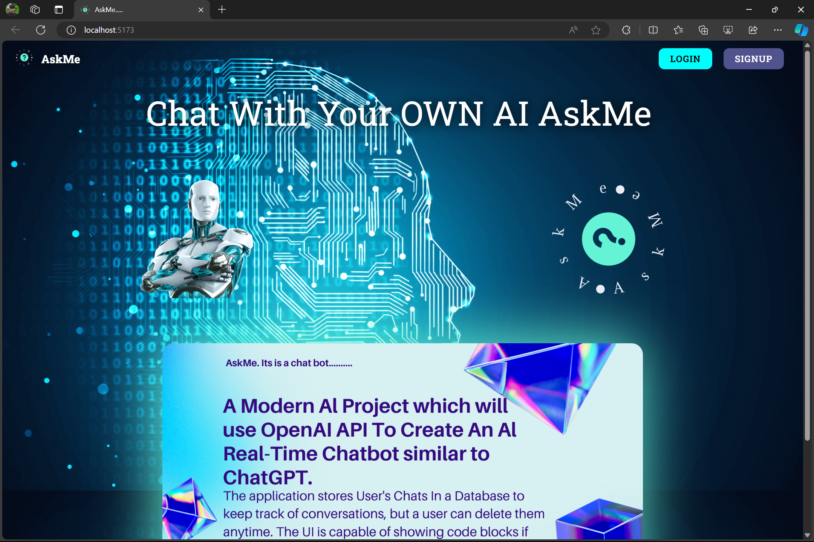
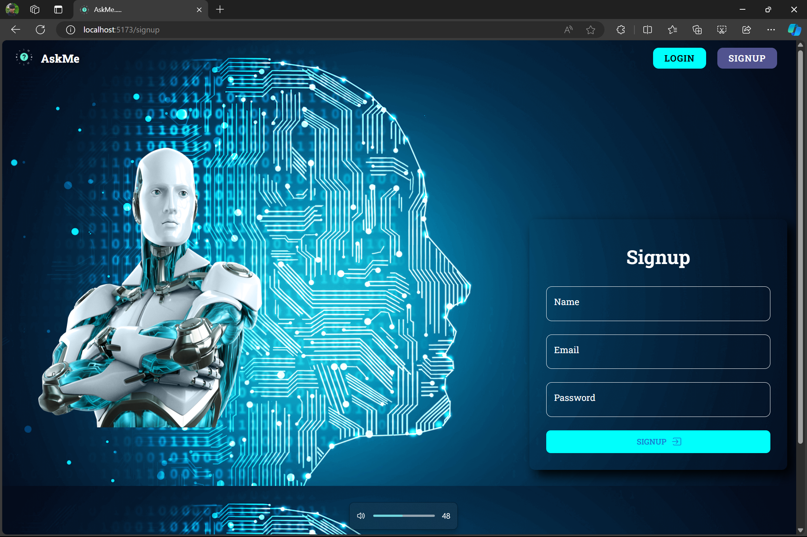
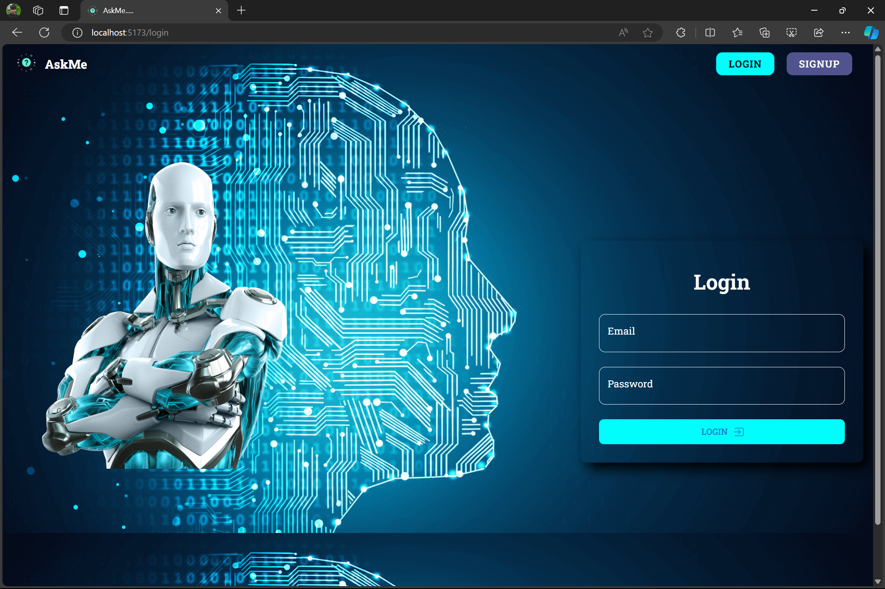

# MERN Stack AI Chatbot

This is an AI Chatbot application, inspired by ChatGPT, by using MERN Stack and OpenAI

It's a customized chatbot where each message of the user is stored in DB and can be retrieved and deleted.

It's a completely secure application using JWT Tokens, HTTP-Only Cookies, Signed Cookies, Password Encryption, and Middleware Chains.

Contributions are welcome

&nbsp;

&nbsp;

&nbsp;

